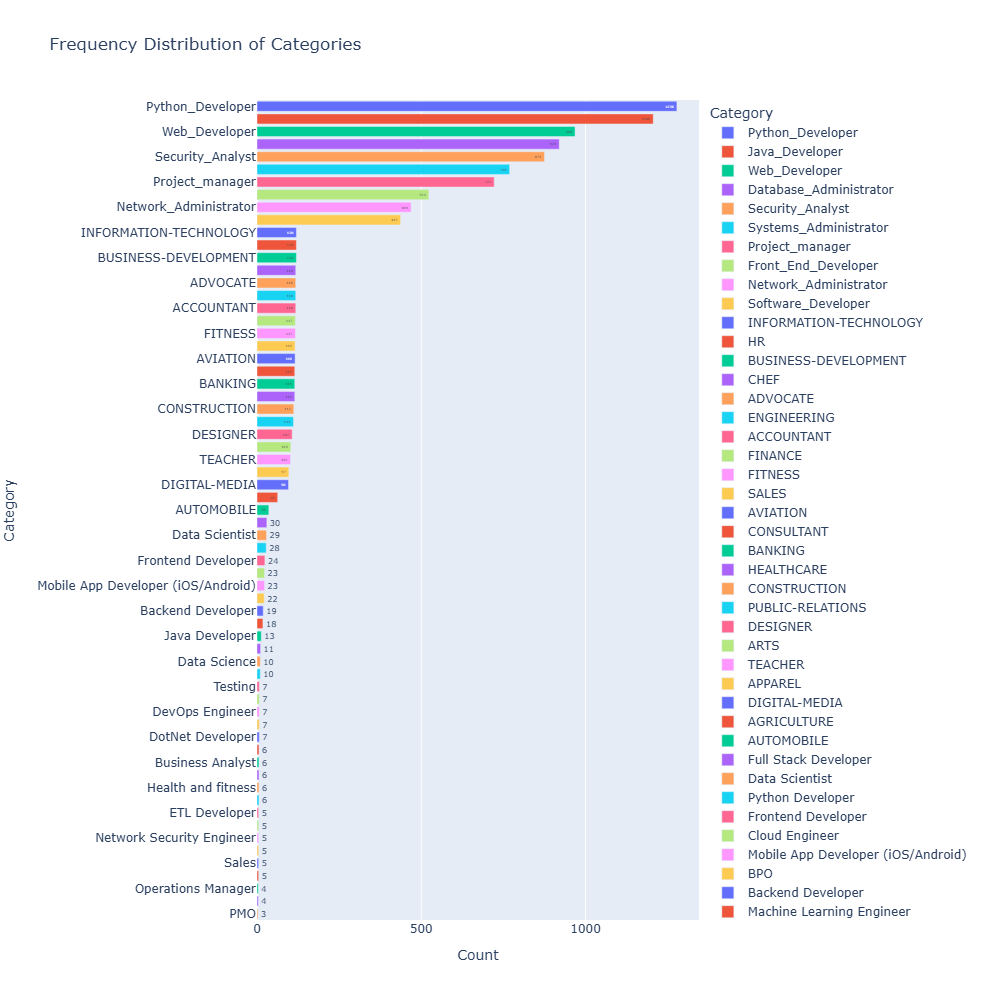

# Resume Insights and Optimization

## 1. Title and Author

* **Project Title**: Resume Insights and Optimization
* **Prepared for**: UMBC Data Science Master Degree Capstone by Dr. Chaojie (Jay) Wang
* **Author Name**: Sreya Sree Siloju
* **GitHub Repository**: [GitHub Repo](https://github.com/sreya0299)
* **LinkedIn Profile**: [LinkedIn Profile](https://www.linkedin.com/in/sreya-sree-siloju-a29224149/)
* **PowerPoint Presentation**: PowerPoint Presentation
* **YouTube Video**: YouTube Video
  
---

## 2. Background

### What is it About?
This Project analyzes resumes to extract key details like skills, experience, and education. It offers suggestions for improving the resume by identifying missing skills, enhancing readability, and matching it to job descriptions. The system may also recommend relevant job positions and provide feedback to make resumes more ATS-compliant. It involves natural language processing (NLP) and machine learning to perform tasks like resume parsing, skill matching, and personalized job recommendations. It helps job seekers optimize their resumes for specific roles.

### Why Does it Matter?
1. **Improves Resume Shortlisting**: It allows candidates to tailor their resumes to specific job descriptions by recommending skills or qualifications they may lack, increasing their chances of aligning with job description.
2. **Reduces Time and Effort**: This automates the resume review process, allowing job seekers to quickly understand what improvements are needed while helping recruiters filter out unqualified candidates more efficiently.
3. **Enhances personalised Skill Development**: By identifying gaps in a resume and suggesting relevant skills or certifications, the system encourages continuous learning and professional development, aligning candidates with current market demands.

### Research Questions:
1. **Model Effectiveness**: How effectively does the model identify skill gaps between a candidate's resume and industry-standard requirements?
2. **Handing Multiple Resumes**: How well does the model handle various resume structures and formats when extracting relevant information?
3. **Skill Upgrade Recommendation**: How accurately can the model predict suitable job roles based on the skills and experience presented in the resumes?

---

## 3. Data

### Data Sources:
**Dataset 1**
* [Dataset 1](https://www.kaggle.com/datasets/jillanisofttech/updated-resume-dataset)
* **Data Size**: 3.11 MB
* **Data Shape**: 962 X 2
* The dataset contains 962 rows and 2 columns

**Dataset 2**
* [Dataset 2](https://www.kaggle.com/datasets/snehaanbhawal/resume-dataset)
* **Data Size**: 118.29 MB
* **Data Shape**: 2484 X 4
* The dataset contains 2484 rows and 4 columns

**Dataset 3**
* [Dataset 3](https://www.kaggle.com/datasets/jithinjagadeesh/resume-dataset)
* **Data Size**: 338.76 KB
* **Data Shape**: 400 X 2
* The dataset contains 400 rows and 2 columns

**Dataset 4**
* [Dataset 4](https://www.kaggle.com/datasets/avishekmajhi/resume-dataset)
* **Data Size**: 64.58 MB
* **Data Shape**: 8234 X 2
* The dataset contains 8234 rows and 2 columns 

### Representation of Dataset ?
* **Category**: Each row represents the category to which the resume belongs 
* **Resume**: Resume columns consists of resumes of each individual in the raw text.

### Data Dictionary:

| **Column Name** | **Data Type** | **Definition** | **Values**                            |
|-----------------|---------------|----------------|---------------------------------------|
| category        | string        | The field that the resume corresponds to, It indicates the type of job the resume is targeting.  | Java Developer, Operations Manager, Data Science, Testing etc. |
| Resume          | string        | The textual content of the resume contains the complete resume of an individual in raw text format, including their skills, education, experience, personal deatils etc.     | NA |

**Target/Label**:

1. **Category**: It is used as the **target** variable for classification tasks in which the model will attempt to predict the appropriate job category based on the content of the resume.

2. **Feature/Predictors**:
**Resume**: It contains the text of the resumes and is the **feature**. It is the input data that will be processed to extract relevant information (skills, experience, education etc.) to predict the target category.
The in-depth features that are extracted from each resume are:
* **Skills**:
  * **Technical Skills**: Programming languages (e.g., Python, Java), tools (e.g., Power BI, Tableau), and technologies (e.g., AWS, Azure).
  * **Soft Skills**: Communication, leadership, teamwork, problem-solving.
* **Education**:
  * **Degree Level**: Bachelor’s, Master’s, Ph.D.
  * **Field of Study**: Computer Science, Engineering, Finance, etc.
  * **Institutions**: Name of the universities or schools attended.
  * **Graduation Year**: Year the degree was completed.
* **Professional Experience**:
  * **Job Titles**: Positions held (e.g., Data Analyst, Software Engineer).
  * **Years of Experience**: The total number of years or specific time periods of work.
  * **Companies**: Names of companies or organizations where the individual worked.
  * **Job Responsibilities**: The tasks performed in each role.
* **Keywords and Phrases**:
  * Specific industry-related terms that are commonly found in job descriptions and are required for matching (e.g., "Machine Learning," "Data Analysis," "Project Management", "Big Data").

**Packages and Technologies**:
* Backend Development using **Python** programming language
* Text is converted into numericals using **TFID Vectorizer**, **KNeighborsClassifier** and **OneVsRestClassifier** are used for classification of the resume into it's category as there are multiple classes in the target variable.
* Machine Learning Packages are used for model training and model predicting to which the resume belongs to which helps in identifyinng the skills responsible for each category. 
* By using **NLTK**, the resume text is processed and cleaned, ensuring better input for further tasks like feature extraction and classification.
* **NLP** concepts like Named Entity Recognition (NER) are used for identifying the key words from the resume like skills, experience, technologies worked on etc.
* **Streamlit** is used for creating a web interface for evaluating the resume with provided job description.
---
## 4. Exploratory Data Analysis (EDA)

1. **Merging Datasets** : To consolidate data for analysis, utilized the concat function from the pandas library to merge four distinct datasets. This operation resulted in a unified dataset containing 11,003 rows and 2 columns. Each row represents a unique resume, and each resume is categorized according to its specific category. This structured format facilitates further analysis, allowing to explore the relationships and distributions of resumes across different categories effectively.
2. **Checking for NUll/Missing values** : The integrity of the dataset is crucial for accurate analysis. Conducted a thorough examination for any NULL or missing values using the *isna()* function. The outcome of this analysis revealed that there are no missing values within the dataset. Consequently, proceeded with the analysis without the need to address any missing data, ensuring that findings are based on a complete dataset.
3. **Identifying the duplicates**: Standardizes various representations of the same category by mapping them to a consistent label, such as consolidating *Python_Developer* and *Python Developer* into *Python Developer* and same with the *Java_Developer* and remaining categories. This enhances clarity, facilitates analysis, and reduces redundancy in the dataset, making it easier to work with and maintain as new variations are identified.
4. **Statistics of Dataset** : To gain insights into the dataset’s composition, employed the *describe(include='all')* function. This summary statistic provides a comprehensive overview of the dataset, including:
  * Count: The total number of records, which is 11,003.
  * Unique Values: The total number of distinct categories present in the dataset, totaling 62 unique categories.
  * Most Frequent Data: The function also identifies the most frequently occurring data points, presenting their respective frequencies. This information is invaluable as it highlights the dominant categories and resume types, guiding focus for further exploration and analysis.
5. **Distribution of Categories**: Analyzing the distribution of the categories is essential to understand how the resumes are spread across different categories. Dataset includes 65 unique categories, and the distribution is not uniform. Some categories may contain a significantly higher number of resumes compared to others, indicating possible trends or preferences in resume submissions. Utilized *Plotly Express* to visually represent this distribution, creating interactive plots that illustrate the frequency of resumes within each category. This visual exploration aids in identifying categories that may require deeper analysis or consideration for future projects.
  
* **Categories with frequency**
  
| **Category**    | **Count** |
|-----------------|---------------|
|	Python Developer	|	1371	|
|	Java Developer	|	1326	|
|	Web Developer	|	984	|
|	Database_Administrator	|	920	|
|	Security_Analyst	|	876	|
|	Systems_Administrator	|	776	|
|	Project_manager	|	722	|
|	Front End Developer	|	584	|
|	Network_Administrator	|	469	|
|	Software_Developer	|	437	|
|	HR	|	154	|
|	BUSINESS-DEVELOPMENT	|	120	|
|	INFORMATION-TECHNOLOGY	|	120	|
|	ACCOUNTANT	|	118	|
|	ENGINEERING	|	118	|
|	FINANCE	|	118	|
|	CHEF	|	118	|
|	ADVOCATE	|	118	|
|	FITNESS	|	117	|
|	AVIATION	|	117	|
|	SALES	|	116	|
|	BANKING	|	115	|
|	CONSULTANT	|	115	|
|	HEALTHCARE	|	115	|
|	CONSTRUCTION	|	112	|
|	PUBLIC-RELATIONS	|	111	|
|	DESIGNER	|	107	|
|	ARTS	|	103	|
|	TEACHER	|	102	|
|	APPAREL	|	97	|
|	DIGITAL-MEDIA	|	96	|
|	Testing	|	70	|
|	AGRICULTURE	|	63	|
|	Backend Developer	|	57	|
|	Cloud Engineer	|	56	|
|	DevOps Engineer	|	55	|
|	Data Scientist	|	53	|
|	Full Stack Developer	|	47	|
|	Web Designing	|	45	|
|	Mobile App Developer (iOS/Android)	|	45	|
|	Machine Learning Engineer	|	43	|
|	Hadoop	|	42	|
|	Data Science	|	40	|
|	Mechanical Engineer	|	40	|
|	Blockchain	|	40	|
|	Sales	|	40	|
|	Operations Manager	|	40	|
|	ETL Developer	|	40	|
|	AUTOMOBILE	|	36	|
|	Arts	|	36	|
|	Database	|	33	|
|	Health and fitness	|	30	|
|	PMO	|	30	|
|	Electrical Engineering	|	30	|
|	Business Analyst	|	28	|
|	DotNet Developer	|	28	|
|	Automation Testing	|	26	|
|	Network Security Engineer	|	25	|
|	Civil Engineer	|	24	|
|	SAP Developer	|	24	|
|	BPO	|	22	|
|	Advocate	|	20	|

  
* **Bar Graph Distribution**
  * Dominant Category: *Python Developer* stands out as the most frequent category, making up a significant portion of the dataset. This dominance may lead to a bias, affecting the model's accuracy in classifying other categories.
  * Least Dominant Category: In contrast, *Advocate* is the least represented category, posing challenges for the model due to the limited training examples available.

* **Pie Chart Distribution**
  * Percentage Representation: *Python Developer* comprises 11.3% (about 1,371 resumes) of the total 11,003 resumes, reinforcing its dominance.
  * Minor Categories: The *Advocate* category accounts for only 0.166% (around 20 resumes), highlighting the difficulties the model may face in accurately classifying such underrepresented categories.

### Preporocessing Data

* **Cleaning the Resume**

  The *cleanResume* function serves as a crucial preprocessing step for analyzing resume text data. By systematically removing unnecessary elements, it enhances the quality of the input data for further processing, such as feature extraction, classification, and machine learning model training. This function is particularly valuable in scenarios where clean and structured text data is essential for generating insights and making accurate predictions in resume analysis and related fields.
  * **URL Removal**: Any web links present in the resume text are eliminated to focus on the content.
  * **Social Media Elements**: Mentions of retweets (RT) and carbon copies (CC), along with hashtags and user handles (e.g., @username), are removed to maintain a professional tone.
  * **Special Character Elimination**: Non-essential special characters are stripped away, helping to standardize the text and reduce noise.
  * **Non-ASCII Character Removal**: Characters outside the standard ASCII range are removed to ensure compatibility with various text processing tools.
  * **Whitespace Normalization**: Extra spaces, tabs, and newline characters are consolidated into single spaces, resulting in a cleaner layout.
  * **Alphanumeric Filtering**: Only letters, numbers, and spaces are retained, removing any irrelevant punctuation or symbols.
  * **Final Space Reduction**: Multiple consecutive spaces are replaced with a single space, enhancing the readability of the text.

* **Extracting the most frequent words**
  
  The *get_most_frequent_words* function is used to analyze a collection of resumes and identify the most commonly occurring words within that text. It serves purposes:
  * **Text Analysis**: By examining the frequency of words, the function helps highlight important skills, qualifications, and experiences presented in the resumes.
  * **Stop Word Removal**: It filters out common English words (like "and," "the," and "is") that do not provide significant information, focusing instead on more meaningful terms that reflect the candidates' competencies.
  * **Customization**: Users can specify additional words to exclude from the analysis, allowing for tailored results based on the context of the resumes being analyzed.
  * **Insights Generation**: The function counts the occurrences of filtered words and returns the most frequent ones, which can inform hiring decisions, identify trends in candidate skills, or enhance resume parsing systems.

**Most frequent words obtained from entire dataset**

**Most frequent words obtained from dataset with categories**

* **Labelling the categories**
  
  The process described involves converting categorical data into a numerical format suitable for machine learning models.
  * **Categorical Data Conversion**: The *LabelEncoder* is used to transform string labels representing different categories into numerical labels. This is essential because many machine learning algorithms require numerical input.
  * **Learning Unique Categories**: The method analyzes the unique categories present in the dataset, enabling it to understand how to assign numerical values to each category.
  * **Generating Numeric Labels**: Each category is then replaced with a corresponding numeric label, creating a new representation of the data. This allows the model to process the categories effectively.

**Labels for each category**

|Category|Label|
|--------|-----|
|	Python Developer	|	51	|
|	Java Developer	|	41	|
|	Front End Developer	|	34	|
|	Network_Administrator	|	46	|
|	Project_manager	|	50	|
|	Security_Analyst	|	55	|
|	Software_Developer	|	56	|
|	Systems_Administrator	|	57	|
|	Web Developer	|	61	|
|	Database_Administrator	|	26	|
|	Data Science	|	23	|
|	HR	|	37	|
|	Advocate	|	7	|
|	Arts	|	8	|
|	Web Designing	|	60	|
|	Mechanical Engineer	|	43	|
|	Sales	|	54	|
|	Health and fitness	|	39	|
|	Civil Engineer	|	19	|
|	Business Analyst	|	15	|
|	SAP Developer	|	53	|
|	Automation Testing	|	9	|
|	Electrical Engineering	|	31	|
|	Operations Manager	|	47	|
|	DevOps Engineer	|	27	|
|	Network Security Engineer	|	45	|
|	PMO	|	48	|
|	Database	|	25	|
|	Hadoop	|	38	|
|	ETL Developer	|	30	|
|	DotNet Developer	|	28	|
|	Blockchain	|	14	|
|	Testing	|	59	|
|	Backend Developer	|	13	|
|	Data Scientist	|	24	|
|	Full Stack Developer	|	35	|
|	Mobile App Developer (iOS/Android)	|	44	|
|	Machine Learning Engineer	|	42	|
|	Cloud Engineer	|	20	|
|	DESIGNER	|	21	|
|	INFORMATION-TECHNOLOGY	|	40	|
|	TEACHER	|	58	|
|	ADVOCATE	|	1	|
|	BUSINESS-DEVELOPMENT	|	12	|
|	HEALTHCARE	|	36	|
|	FITNESS	|	33	|
|	AGRICULTURE	|	2	|
|	BPO	|	11	|
|	SALES	|	52	|
|	CONSULTANT	|	18	|
|	DIGITAL-MEDIA	|	22	|
|	AUTOMOBILE	|	5	|
|	CHEF	|	16	|
|	FINANCE	|	32	|
|	APPAREL	|	3	|
|	ENGINEERING	|	29	|
|	ACCOUNTANT	|	0	|
|	CONSTRUCTION	|	17	|
|	PUBLIC-RELATIONS	|	49	|
|	BANKING	|	10	|
|	ARTS	|	4	|
|	AVIATION	|	6	|
